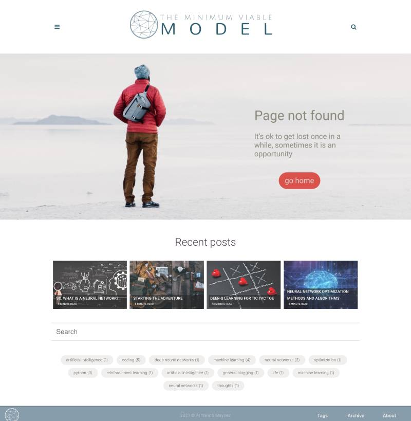

> ## 1.简介

    AXI（Advanced eXtensible Interface）是一种总线协议，该协议是ARM公司提出的AMBA（Advanced Microcontroller Bus Architecture）3.0协议中最重要的部分，是一种面向高性能、高带宽、低延迟的片内总线。它的地址/控制和数据相位是分离的，支持不对齐的数据传输，同时在突发传输中，只需要首地址，同时分离的读写数据通道、并支持Outstanding传输访问和乱序访问，并更加容易进行时序收敛。AXI 是AMBA 中一个新的高性能协议。AXI 技术丰富了现有的AMBA 标准内容，满足超高性能和复杂的片上系统（SoC）设计的需求。

> ## 2.功能

AXI 能够使SoC 以更小的面积、更低的功耗，获得更加优异的性能。AXI 获得如此优异性能的一个主要原因，就是它的单向通道体系结构。单向通道体系结构使得片上的信息流只以单方向传输，减少了延时。
选择采用何种总线，我们要评估到底怎样的总线频率才能满足我们的需求，而同时不会消耗过多的功耗和片上面积。ARM一直致力于以最低的成本和功耗追求更高的性能。这一努力已经通过连续一代又一代处理器内核的发布得到了实现，每一代新的处理器内核都会引入新的流水线设计、新的指令集以及新的高速缓存结构。这促成了众多创新移动产品的诞生，并且推动了ARM架构向性能、功耗以及成本之间的完美平衡发展。
AXI总线是一种多通道传输总线，将地址、读数据、写数据、握手信号在不同的通道中发送，不同的访问之间顺序可以打乱，用BUSID来表示各个访问的归属。主设备在没有得到返回数据的情况下可发出多个读写操作。读回的数据顺序可以被打乱，同时还支持非对齐数据访问。
AXI总线还定义了在进出低功耗节电模式前后的握手协议。规定如何通知进入低功耗模式，何时关断时钟，何时开启时钟，如何退出低功耗模式。这使得所有IP在进行功耗控制的设计时，有据可依，容易集成在统一的系统中。AXI与上一代总线AHB的主要性能比较见表1。

<!-- Recently I was [reading an article](https://www.rollingstone.com/music/music-features/nirvana-kurt-cobain-ai-song-1146444/) about a cool project that intends to have a neural network create songs of the late club of the 27 (artists that have tragically died at age 27 or near, and in the height of their respective careers), artists such as Amy Winehouse, Jimmy Hendrix, Curt Cobain and Jim Morrison.

<iframe width="560" height="315" src="https://www.youtube.com/embed/tjzOzuKQhSM" title="YouTube video player" frameborder="0" allow="accelerometer; autoplay; clipboard-write; encrypted-media; gyroscope; picture-in-picture" allowfullscreen></iframe>

The project was created by [Over the Bridge](https://overthebridge.org), an organization dedicated to increase awareness on mental health and substance abuse in the music industry, trying to denormalize and remove the glamour around such illnesses within the music community.

They are using Google's [Magenta](https://magenta.tensorflow.org), which is a neural network that precisely was conceived to explore the role of machine learning within the creative process. Magenta has been used to create a brand new "Beatles" song or even there was a band that [used it to write a full album](https://arstechnica.com/gaming/2019/08/yachts-chain-tripping-is-a-new-landmark-for-ai-music-an-album-that-doesnt-suck/) in 2019.

So, while reading the article, my immediate thought was: who owns the copyright of these new songs?

Think about it, imagine one of this new songs becomes a massive hit with millions of youtube views and spotify streams, who can claim the royalties generated?

At first it seems quite simple, *Over the Bridge* should be the ones reaping the benefits, since they are the ones who had the idea, gathered the data and then fed the neural network to get the "work of art". But in a second thought, didn't the original artists provide the basis for the work the neural network generated? shouldn't their state get credit? what about Google whose tool was used, should they get credit too?

Neural networks have been also used to create poetry, paintings and to write news articles, but how do they do it? A computer program developed for machine learning purposes is an algorithm that "learns" from data to make future decisions. When applied to art, music and literary works, machine learning algorithms are actually learning from some input data to generate a new piece of work, making independent decisions throughout the process to determine what the new work looks like. An important feature of this is that while programmers can set the parameters, the work is actually generated by the neural network itself, in a process akin to the thought processes of humans.

Now, creative works qualify for copyright protection if they are original, with most definitions of originality requiring a human author. Most jurisdictions, including [Spain](https://www.wipo.int/wipolex/en/details.jsp?id=1319) and [Germany](https://dejure.org/gesetze/UrhG/7.html), specifically state that only works created by a human can be protected by [copyright](https://www.wipo.int/copyright/en/). In the United States, for example, [the Copyright Office has declared](https://copyright.gov/comp3/chap300/ch300-copyrightable-authorship.pdf) that it will “register an original work of authorship, provided that the work was created by a human being.”

So as we currently stand, a human author is required to grant a copyright, which makes sense, there is no point of having a neural network be the beneficiary of royalties of a creative work (no bank would open an account for them anyways, lol).

I think amendments have to be made to the law to ensure that the person who undertook all the arrangements necessary for the work to be created by the neural network gets the credit but also we need to modify copyright law to ensure the original authors of the body of work used as data input to produce the new piece get their corresponding share of credit. This will get messy if someone uses for example the #1 song of every month in a decade to create the decade song, then there would be as many as 120 different artists to credit.

`<tweet>`In a computer generated artistic work, both the person who undertook all the arrangements necessary for its creation as well as the original authors of the data input need to be credited.`</tweet>`

There will still be some ambiguity as to who undertook the arrangements necessary, only the one who gathered the data and pressed the button to let the network learn, or does the person who created the neural network's model also get credit? Shall we go all the way and say that even the programmer of the neural network gets some credit as well?

There are some countries, in particular the UK where some progress has been made to amend copyright laws to cater for computer generated works of art, but I believe this is one of those fields where technology will surpass our law making capacity and we will live under a grey area for a while, and maybe this is just what we need, by having these works ending up free for use by anyone in the world, perhaps a new model for remunerating creative work can be established, one that does not require commercial success to be necessary for artists to make a living, and thus they can become free to explore their art.

`<tweet>`Perhaps a new model for remunerating creative work can be established, one that does not require commercial success to be necessary for artists to make a living.`</tweet>`

`<small>`[The Next Rembrandt](https://www.jwt.com/en/work/thenextrembrandt) is a computer-generated 3-D–printed painting developed by a facial-recognition algorithm that scanned data from 346 known paintings by the Dutch painter in a process lasting 18 months. The portrait is based on 168,263 fragments from Rembrandt’s works.`</small>` -->
