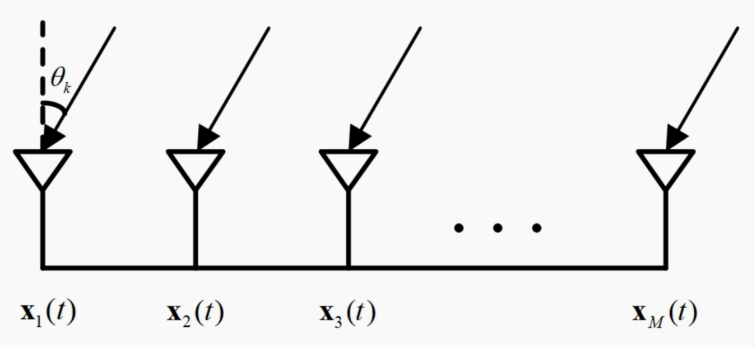
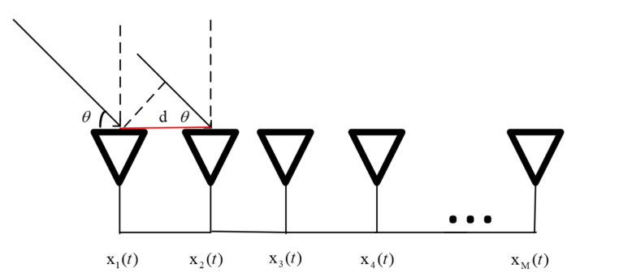
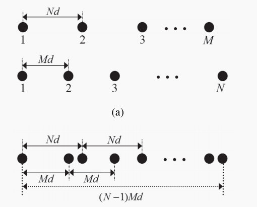
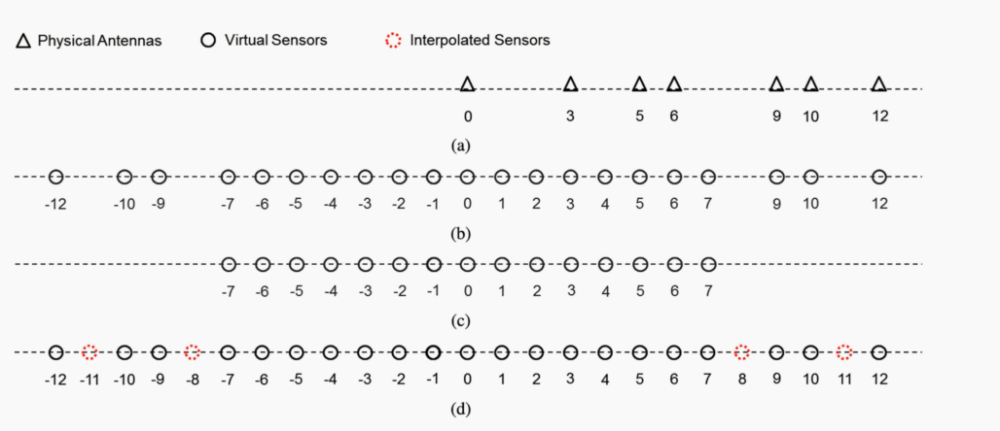
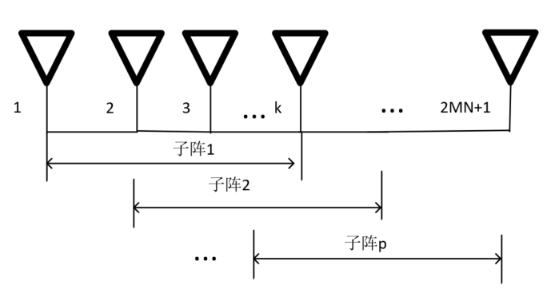
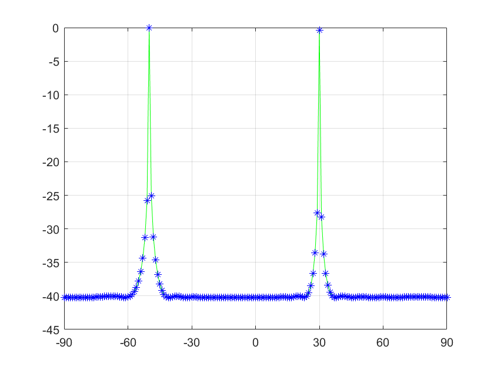

## 1.基本假设

&emsp;&emsp;在论文当中，所有的研究主要基于以下几个基本假设：

* 假设入射源位于阵列无限远处，从而阵列接收到的信号可以看作是平面波；
* 假设信号带宽远小于信号的中心频率，即窄带信号，并且满足各态历经性；
* 所有阵元为全向接收阵元，且阵元之间不存在互耦效应。阵元已完全校正，不存在位置误差和幅相不一致的情况，且阵元之间的间隔以半波长为单位；
* 不同时刻和不同阵元上所接收到的噪声相互独立。

## 2.阵列信号模型

&emsp;&emsp;按照阵元摆放的不同形式，天线阵列主要可分为面阵和线阵两大类。其中面阵包括均匀矩形阵（Uniform Rectangular Array: URA）、稀疏矩形阵（Sparse Rectangular Array: SRA）、L/T型阵和圆阵（Circular Array: CA）等，线阵包括 ULA 和 SLA。本文将主要介绍均匀线阵和互质阵。

### 2.1 均匀线阵模型

&emsp;&emsp;以一个由 M 个阵元构成的一维线性阵列为例，假设有 K 个远场窄带非相关入射信号源，来波方向分别为 $\theta_k$，k = 1, 2, · · · , K，如图2.1所示。

<div align=center>

</div>

<center>图2.1 一维线性阵列模型</center>

&emsp;&emsp;将阵列首个阵元视为参考阵元，则在 t 时刻，第 k 个信源使得首个阵元的接收信号为：

$$
\begin{equation}
S_{k} =  u_{k}(t)exp(j(\omega_{0}t+\varphi(t)) ),k= 1,2,...,K \tag{2-1}
\end{equation}
$$

&emsp;&emsp;其中，$j$ 表示虚部单位，$U_{k}(t)$ 、  $\omega_{0}$  、  $\varphi(t)$表示接收信号的幅度、频率和相位。因此，在 t 时刻，第 m 个阵元的接收信号可表示为：

$$
\begin{equation}
x_{m}(t) =  \sum_{k=1}^{K}S_{k}(t-\tau_{m,k} ) + n_{m}(t),m= 1,2,...,M\tag{2-2}
\end{equation}
$$

&emsp;&emsp;其中，$n_{m}(t)$表示第 $m$个阵元接收到的加性高斯白噪声，$\tau_{m}k)$表示对应于第 k 个信号在第 M个阵元的参考接收信号时延。`<br/><br/>`
&emsp;&emsp;由远场窄带信号假设可得：

$$
\begin{equation}
S_{k}(t-\tau ) \approx  S_{k}(t)exp(-j \omega_{0} \tau),m= 1,2,...,M\tag{2-3}
\end{equation}
$$

&emsp;&emsp;因此，式(2-2)可转化为：

$$
\begin{equation}
x_{m}(t) =  \sum_{k=1}^{K}S_{k}(t)exp(-j \omega_{0} \tau_{m,k}) + n_{m}(t),m= 1,2,...,M\tag{2-4}
\end{equation}
$$

&emsp;&emsp;则，t时刻的阵列输出为：

$$
\begin{equation}
x(t) =  \sum_{k=1}^{K}a(\theta_k)S_{k}(t) + n(t) = A(\theta)s(t)+ n(t)\tag{2-5}
\end{equation}
$$

&emsp;&emsp;其中$x(t) = [x_{1}(t),...,x_{N}(t)]^T \in C^N$,为阵列输出，$A(\theta) = [a(\theta_1),...,a(\theta_K)] \in C^{N \times K}$,为阵列流形矩阵，$s(t) = [s_{1}(t),...,s_{K}(t)]^T \in C^K$ ,为入射信号，$n(t)  \in C^N$ 为阵列接收到的高斯白噪声.式（2-5）一般写作如下

$$
\begin{equation}
X = AS+ N\tag{2-6}
\end{equation}
$$

* **[1] 当$\theta \in (-{\frac{\pi}{2}},{\frac{\pi}{2}})$,即如图2.1所示建模**

$$
\begin{equation}
a(\theta_k) = [1,e^{(-j2\pi{\frac{dcos(\theta_k)}{\lambda}})},..., e^{(-j2\pi{\frac{(M-1)dcos(\theta_k)}{\lambda}})}]^T      \tag{2-7}
\end{equation}
$$

* **[2] 当$\theta \in (-{\pi},{\pi})$,即如图2.2所示建模**

<div align=center>

</div>

<center>图2.2 一维线性阵列模型2</center>

$$
\begin{equation}
a(\theta_k) = [1,e^{(-j2\pi{\frac{dsin(\theta_k)}{\lambda}})},..., e^{(-j2\pi{\frac{(M-1)dsin(\theta_k)}{\lambda}})}]^T       \tag{2-8}
\end{equation}
$$

### 2.2 互质阵列模型

#### 2.2.1 简单互质阵

&emsp;&emsp;考虑两个分别有M和N个传感器的均匀线阵，其中M和N是质数。如图2.3所示，由M个传感器组成的阵列的间距为Nd，而由N个传感器组成的阵列的间距为Md。

<div align=center>

</div>

<center>图2.3 简单互质阵</center><br/><br/>

&emsp;&emsp;假设$M<N$,且 $d= {\frac{\lambda}{2}}$ ，由于质数的特性，上图中由（a）中的两个天线阵组合成的阵列将会共享第一个天线，且后续的天线不会发生覆盖。因此，互质线阵的物理传感器（天线）一共$M+N-1$个，且最后一个阵元位置在$(N-1)Md$处。差分阵列可以计算为

$$
\begin{equation}
x(m,n) = Mn - Nm       \tag{2-9}
\end{equation}
$$

&emsp;&emsp;其中$ 0 < m <N-1$,$0<n<M-1$,因为M、N互为质数，在MN个不（m,n）组合下，由$x(m,n)$可以获得MN个不同的差值。因此，仅仅使用$M+N-1$个实际天线就可以获得具有MN个名义天线的虚拟阵列，其位于${    (Mn-Nm) d,0<m<N-1,0<n<M-1  }$，这意味着阵列自由度（DOF）可以由$O(M+N)$增加到$O(MN)$，更进一步，此处只考虑$Mn - Nm$,因为还包含$Nm - Mn$,即$-x(m,n)$,因此可以增加到

$$
\begin{equation}
-M(N-1) \le x(m,n)   \le   M(N-1)   \tag{2-10}
\end{equation}
$$

&emsp;&emsp;然而，所得到的的虚拟阵列并不是连续的，其存在孔洞（即不连续的部分），如下图2.4中的$\pm  11$、$\pm  8$位置。然而，一般常规处理方法是需要获得尽可能长的连续虚拟阵列（这里先不考虑基于差值的凸优化算法），因此需要是从虚拟阵列中获得尽可能长的连续阵列，如下图即是-7~7,那么有没有增长虚拟阵列长度的方法呢？从阵列的角度考虑，就引出了接下来的扩展互质阵。

互质阵列如下图所示

<div align=center>

</div>

<center>图2.4 互质阵及其所得虚拟阵</center>

#### 2.2.2 扩展互质阵

&emsp;&emsp;为了解决上一节的问题，我们将组成互质阵中的阵元个数为$M$的子阵阵元数由$M$调整为$2M$,以获得一个扩展的互质阵，如图2.5 扩展互质阵所示。

<div align=center>

</div>

<center>图2.5 扩展互质阵</center>
  因此得到的差分阵列为

$$
\begin{equation}
S_d =  \{     \hat{x}(m,n)|\hat{x}(m,n)=\pm(Mn-Nm),0 \le m  \le2M-1,0 \le n  \le N-1     \}  \tag{2-11}
\end{equation}
$$
  因此在我们得到的差分阵列中，可以获得一个最长连续子阵列范围为$-MN$到$MN$。

#### 2.2.1 举例SS-MUSIC(以扩展互质阵为例，上一节)

**（1）接收信号模型**

&emsp;&emsp;假设有K个远场、不相关的、窄带信源信号作用于扩展互质阵接收天线，其角度$\theta = [\theta_1,\theta_2，...,\theta_K]^T$,在时间$t$时，接收信号向量为

$$
\begin{equation}
y(t) =  \sum_{k=1}^{K}a(\theta_k)s_{k}(t) + n(t)=A(\theta)s(t)+n(t)\tag{2-12}
\end{equation}
$$

&emsp;&emsp;其中$A(\theta) = [a(\theta_1),a(\theta_2),...,a(\theta_K)] \in C^{(2M+N-1) \times K}$,为阵列流形矩阵,$s(t) = [s_1(t),s_2(t)，...,s_K(t)]^T \in C^K$表示信号波形矢量$\boldsymbol{n}(t) \backsim CN(\boldsymbol{0},\delta_{n}^2\boldsymbol{I})$,这里$\delta_{n}^2$表示噪声功率水平。以$L = [l_1,l_2,...,l_{2M+N-1}]^T$表示阵元位置，则

$$
\begin{equation}
a(\theta_k) =  [1,e^{-j2\pi l_2 \frac{dsin(\theta_k)}{\lambda} },...,e^{-j2\pi l_{2M+N-1} \frac{dsin(\theta_k)}{\lambda} }     ] \tag{2-13}
\end{equation}
$$

接收信号$y(t)$形成的协方差矩阵可以表示为，其中$\delta_{k}^2$表示第$k$个信源的功率。$P = diag([\delta_{1}^2,\delta_{2}^2,...,\delta_{k}^2])$

$$
\begin{equation}

\begin{aligned}
R &=  E[y(t)y(t)^H] \\
  &=  \sum_{k=1}^{K} \delta_{k}^2 a(\theta_k)a(\theta_k)^H + \delta_{k}^2 \boldsymbol{I} \\
  &=  APA^H + \delta_{k}^2 \boldsymbol{I}
\end{aligned}
\tag{2-14}
\end{equation}
$$

考虑到上述的$R$在实际中无法直接获，一般用采样协方差替代

$$
\begin{equation}

\begin{aligned}
\hat R &=  \frac{1}{T}   \sum_{t=1}^{T}{y(t)y(t)^H} \\
  		&=   \frac{1}{T} YY^H
  
\end{aligned}
\tag{2-15}
\end{equation}
$$

**（2）SS-MUSIC**

引入如下两个定义：

**定义一**：虚拟阵元权值函数：令虚拟阵列中第p个虚拟阵元重复的次数为该虚拟阵元的权值函数$w(p)$，则 $w(p)$可表示为：$w(p) = \{    P_i,P_j \in P | P_i - P_j = P \}$

**定义二**：冗余阵元整合矩阵：令$J \in C^{({M+N-1})^2 \times (2MN+1)}$为冗余阵元整合矩阵，则$J$中对应的第$p$个虚拟阵元的行向量可以表示为：

$$
\begin{equation}
J(p.:) = vec(I(p)) \tag{2-16}
\end{equation}
$$

$$
\begin{equation}
\begin{aligned}
        I(p)(P_i,P_j)=\left\{
                \begin{array}{ll}
                  \frac{1}{w(p)} &,Pi-P_j         \\
                  0   &,else                       \\
          
                \end{array}
         \right.
\end{aligned}
\tag{2-17}
\end{equation}
$$

&emsp;对接收协方差矩阵矢量化得到$z$，从其中选取连续虚拟阵元对应的部分得到v

$$
\begin{equation}
  		z =   vec(\hat R) 
\tag{2-18}
\end{equation}
$$

$$
\begin{equation}
  		v =   Jz
\tag{2-19}
\end{equation}
$$

此时得到的$v \in C^{(2MN+1) \times 1}$,因为其秩为1，因而限制了其可探测的目标数，因此这里采取空间平滑的操作进行秩的恢复，如下图2.6 空间平滑。
<div align=center>

</div>

<center>图2.6 空间平滑</center>

计算所的子阵平均协方差$R_ss$，假设取每个字阵长度为$MN$，则有$MN+1$个子阵

$$
\begin{equation}
  		R_{ss} =    \frac{1}{MN+1}  \sum_{i=1}^{MN+1} v_{U_i}v_{U_i}^H
\tag{2-20}
\end{equation}
$$

最后对获得的$R_{ss}$应用MUSIC算法，即可。仿真设置信源角度为$[-50^{。},30^{。}]$，仿真结果如下图
<div align=center>

</div>

<center>图2.7 仿真结果</center>

## 3.参考文献

[1] Zhou, C., et al. (2018). "Direction-of-Arrival Estimation for Coprime Array via Virtual Array Interpolation." IEEE Transactions on Signal Processing 66(22): 5956-5971.<br/><br/>
[2]Zhou, C., et al. (2018). "Off-Grid Direction-of-Arrival Estimation Using Coprime Array Interpolation." IEEE Signal Processing Letters 25(11): 1710-1714.<br/><br/>
[3] C.-L. Liu, P. P. Vaidyanathan, and P. Pal, “Coprime coarray interpolation
for DOA estimation via nuclear norm minimization,” in Proc. IEEE Int.
Symp. Circuits Syst., Montr´eal, QC, Canada, May 2016, pp. 2639–2642.

## 4.附录（程序）

### 4.1 信号发生程序

```
Params.c = 3 * 1e8;
Params.f = 75 * 1e6;
Params.lambda = Params.c / Params.f; %载波波长
Params.fs = 3 * Params.f;
Params.L = 500; %快拍数
Params.snr = 10; %信噪比
Params.t = [1:Params.L] / Params.fs; %时域采样
Params.AntennasNum = 10;
Params.Theta = [-50 30];
Params.Grid = -90:1:90;
% Antennas
M = 3;
N = 5;
Params.Array = Array_f('coprime', 2, M, N, (Params.lambda / 2));
%信号发生，非相干
A = exp(-1 * 1j * 2 * pi * Params.Array.element_positions' * sin(Params.Theta * (pi / 180)) / Params.lambda); %方向向量
K = length(Params.Theta);
S = randn(K, Params.L) .* exp(1j * 2 * pi * ones(K, 1) * Params.f * Params.t);
Y0 = A * S;
Params.Y = awgn(Y0, Params.snr, 'measured'); %加入高斯白噪声
Params.R = Params.Y * Params.Y' / Params.L;
%% 
%最简方法——重排（空间平滑、拓普利兹）

% figure(1)
[Pmusic_db, Theta] = Coprime_f(Params, Params.R, M, N);
```

### 4.2 函数

```
%%%%%%%%%%%%%%%%%%%%%%%%%%%%%%%%%%%%%%%%%%%%%%
%
% Copyright (c), 2022-2025, xxxx. Co., Ltd.
%
% @file    :
%
% @brief   :paper "Direction-of-Arrival Estimation for Coprime Array
%            via Virtual Array Interpolation"
%           a novel virtual array interpolation-based algorithm
%           for coprime array
% @version :
%
% @author  :hjk
%
% @date    :2023.8.23
%
% Details  :mainly for coprime array
%%%%%%%%%%%%%%%%%%%%%%%%%%%%%%%%%%%%%%%%%%%%%%%
function [Pmusic_db, Theta] = Coprime_f(Params, R, M, N)
    z = vec(R);
    %构造去除冗余阵列
    AntennasNum = Params.AntennasNum;
    D = zeros(AntennasNum, AntennasNum);
    d = Params.Array.element_positions / ((Params.lambda / 2));

    for m = 1:AntennasNum
        D(m, :) = d - d(m);
    end

    D1 = D;
    D = vec(D)';
    [loc, index] = sort(D);
    indD = unique(D); %去除重复项
    dof = length(indD); %阵列自由度
    %
    J = zeros(max(D) - min(D) + 1, length(z));
    array_num = Params.AntennasNum;

    for ik = min(D):max(D)
        II = zeros(array_num, array_num);

    for jk = 1:array_num

    for kk = 1:array_num

    if d(jk) - d(kk) == ik
                    II(jk, kk) = 1 / length(find(D == ik));
                end

    end

    end

    J(ik - min(D) + 1, :) = vec(II).';
    end

    v = J * z;

    %寻找虚拟阵列连续孔径位置
    cnt = M * N + M - 1;
    flag = (length(v) + 1) / 2;
    pos = flag - cnt:1:flag + cnt;
    %
    v_U = v(pos); %虚拟阵列孔径连续
    %空间平滑法
    subarray_num = M * N + M;
    subarray_num_each = length(v_U) - subarray_num + 1;

    Rs = zeros(subarray_num_each, subarray_num_each); % reconstructed covariance matrix

    for i = 1:subarray_num
        z_i = v_U(i:i + subarray_num_each - 1);
        Rs = Rs + z_i * z_i';
    end

    % Rf = Rf / subarray_num;
    Params.Array = ula_1d_f(subarray_num_each, (Params.lambda / 2));
    [Pmusic_db, Theta] = music_f(Params, Params.Grid, Rs);
    %

    h1 = plot(Params.Grid, Pmusic_db, 'g');
    set(gca, 'XTick', [-90:30:90])
    xlim([-90 90])
    grid on
    hold on
    %托普利茨构造法

    cnt = M * N + M;
    Rf = zeros(cnt, cnt);

    for i = 1:1:cnt
        Rf(:, i) = v_U(end - i - cnt + 2:1:end - i + 1);
    end

    % Rf =  toeplitz(v_U(end - cnt+1:1:end));

    Params.Array = ula_1d_f(cnt, (Params.lambda / 2));
    [Pmusic_db, ~] = music_f(Params, Params.Grid, Rf);
    %
    h2 = plot(Params.Grid, Pmusic_db, 'b*');
    set(gca, 'XTick', [-90:30:90])
    xlim([-90 90])
    grid on
    hold on
end
```
